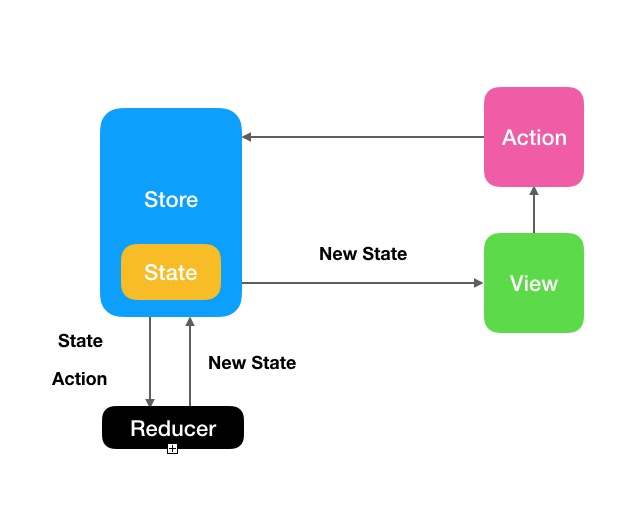
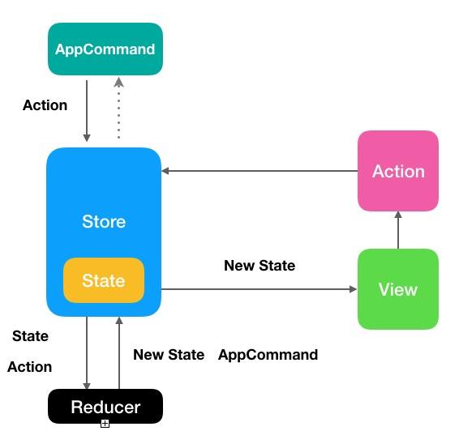

# SwiftUI + Redux

写在前面：SwiffUI到底适合怎样的框架？以往都是MVVM，现在试验性玩一下别的。所以就有了这个Demo。

Redux 是 JavaScript 状态容器，提供可预测化的状态管理。正好SwiftUI的特性和Redux有点搭，看看他们会碰撞出怎样的火花。

## 启动SwiftUILoginDemo

1. 安装node，终端输入 `brew install node`

2. cd到WBlog

3. 执行`npm start`

4. 在Demo中，将localhost改成本机IP地址

5. 运行demo

## 开始之前

[Redux中文文档](https://www.redux.org.cn)

[Flux](http://facebook.github.io/flux/docs/flux-utils)

[Reswift](https://github.com/ReSwift/ReSwift)

## Store, Action, Reducer

1. 将app当作一个状态机，状态决定用户界面

2. Store对象存在这些状态（State）

3. View不能直接操作State，只能通过发送Action，间接改版Store的State

4. Reducer接受原有的State和发送过来的Action，生成新的State

5. 新的State替换Store中原有的状态，并根据新的State驱动更新界面



但是，SwiftUI里本来就有着非常方便的双向绑定行为，比如TextField，就不要做一个专门的Action告诉Store，我的Text改变了，你帮我更新一下State，所以在SwiftUI和combine的加成下，代码方面就有所简化。

注意，Reducer是纯函数特性的，实际开发中，会遇到很多副作用的情况：

- API请求的异步action
  
  通常情况下，我们要做3个action，请求开始、请求成功、请求失败

- 登录成功，改变login状态，并且保存user
  
  可以混在一起进行，也可以加入中间件（middleware）

   

那我们在Demo中的处理是，再多返回一个Command，在Command中开始副作用，回到Demo吧。

## 基本代码

1. Store声明为ObservableObject，这样就可以在View里通过@ObservedObject或者@EnvironmentObject来访问它了
   
   ```swift
   import Combine
   
   class Store: ObservableObject {
       @Published var state: AppState()
   }
   
   struct AppState {
       var loginViewState = LoginViewState()
   }
   
   extension AppState {
       struct LoginViewState {
           
       }
   }
   
   // AppCommand是在设置状态的同时，需要进行的其他操作，完成后发送一个新的action
   protocol AppCommand {
       func execute(in store: Store)
   }
   ```

2. 为登录界面定义一个LoginViewState，负责更新View
   
   ```swift
   struct LoginView: View {
       @EnvironmentObject var store: Store
       var viewBinding: Binding<AppState.LoginViewState> {
           $store.state.loginViewState
       }
       var viewState: AppState.LoginViewState {
           store.state.loginViewState
       }
   
       var body: some View {
           VStack {
               // store.dispath(LoginViewAction)
           }
       }
   }
   ```

3. 定义界面Action，这里选用enum作为Action的类型，编辑器会帮助我们查验哪个action没有被执行
   
   ```swift
   enum LoginViewAction {
       case showHidePassword
       // ...
   }
   ```

4. 发送Action
   
   ```swift
   func dispatch(action: LoginViewAction) {
      // reduce(state, action)
   }
   ```

5. Reducer处理后，返回新的state和需要执行的command
   
   ```swift
   static func reduce(_ state: LoginViewState, _ action: LoginViewAction) -> (LoginViewState, AppCommand?) {
       var nextState = state
       var command: AppCommand?
   
       switch action {
           case .showHidePassword:
              // nextState
              // command?
              // ...
       }
       return (nextState, command)
   }
   ```

如此，我们完整地完成了一个状态更新的事件流



## 疑问？

1. 如何维护日益增大的状态树？

2. dispatch和reducer重构一下？

3. ...
